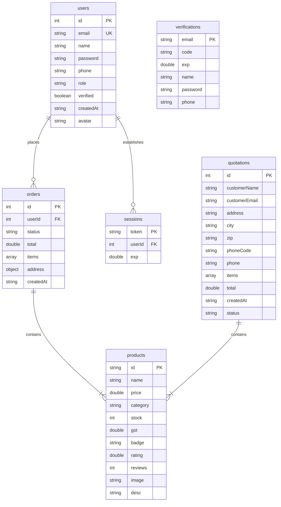

# 🎱 MasterMinds Sportz — High-End Snooker Equipment & POS Suite

MasterMinds Sportz is a premium, serverless, full-featured **E-Commerce and Point-of-Sale (POS) System** built entirely for upscale snooker and billiards equipment. Engineered with a highly modular client-side architecture, this web application requires **no server backend to run**, leveraging state-of-the-art browser APIs to handle complex operations like multi-store transactions, customer authentication, automated order tracking, inventory management, dynamic invoicing, and quotation generation.

Designed with a rich, modern, dark-accented aesthetic, the user interface features smooth gradients, card layouts with generous borders, glassmorphic navigation bars, and fluid, responsive designs optimized for both desktop viewports and mobile screens.

---

## 🚀 Key Features

### 🛒 High-End Storefront Experience
- **Interactive Product Catalog:** Filter seamlessly by 16 curated product categories: *Chalk, Chalk Holder, Cues, Tips, Tips Accessories, Ball Set, Ball Accessories, Cue Cases & Covers, Cue Accessories, Cloth, Cloth Accessories, Player's Accessories, Table Accessories, Tables,* and *Accessories*.
- **Two-Level Filtering System:** A scrollable main category bar with an animated secondary sub-category chip row that reveals brand/type filters (e.g., Cue brands: *LP, Omin, Apex, Maximus, Phoenix*; Ball brands: *Aramith, JDH, Saphire, Baekeland*, etc.).
- **Advanced Sorting & Searching:** Instantly search through products in real time and sort by price (low to high/high to low), rating, and popularity.
- **Product Details Modals:** An immersive popup interface providing high-resolution product imagery, stock availability, ratings, review counts, detailed technical descriptions, and instant add-to-cart controls.
- **Dynamic Cart Side Drawer:** Manages items in real time, displaying item counts, subtotal, and quantities directly from the navigation bar badge.
- **Persistent Address Register:** Caches user shipping details, contact phone numbers, and local postal zip codes directly within the browser for a swift checkout.
- **Product Badges:** Products can be tagged with *New* (blue), *Bestseller* (green), or **Sale** (vibrant orange-red gradient) badges displayed on product cards.

### 💼 Integrated POS (Point-of-Sale) & Document Engine
- **In-Store Billing Suite:** Allows store administrators to construct dynamic invoices or quotations from scratch.
- **Invoice vs. Quotation Modes:** 
  - **Tax Invoice Mode:** Calculates strict taxable subtotals, standard GST (18%), and lists exact company credentials (GSTIN).
  - **Quotation Mode:** Generates a professional pre-sales price proposal complete with validity dates (30 days) and thank-you notes.
- **Premium PDF Generator:** Uses `jsPDF` and `jsPDF-AutoTable` to draw a clean vector-based corporate invoice. The engine dynamically embeds the official **MasterMinds corporate logo** as a base64-encoded asset, constructs data grids, maps customer profiles, and compiles calculations.
- **Automated Dispatches:** Seamless integration with **EmailJS** to send generated invoices, verification codes, or quotes straight to customers.

### 🛡️ Secure Client-Side Authentication
- **Dual Login Methods:** Support for secure, local signups with password hashing or modern **Google OAuth Sign-In**.
- **Secure local hashing:** Custom hash implementation using a highly efficient bitwise client-side hashing algorithm to ensure credentials are not stored in plaintext inside browser databases.
- **Verify-by-Code:** Uses EmailJS to dispatch a 6-digit numeric verification code to confirm user email validity before activating credentials.

### ⚙️ Executive Admin Dashboard
- **Admin Access Level:** Special administrative features unlocked exclusively for the executive root login (`tobi268820@gmail.com`).
- **Dashboard Analytics:** Comprehensive statistical cards displaying *Gross Revenue*, *Completed Order Count*, *Registered Customers*, *Active Product Range*, and *Pending Shipments*.
- **Order Tracking Console:** Real-time filterable tables of all purchases where admins can update shipping status (*Pending, Processing, Shipped, Delivered, Cancelled*) with instant database synchronization.
- **Quotation Manager (Admin):** Dedicated **Quotations** tab in the admin panel listing every customer-generated quotation. Admins can:
  - **Edit line-item prices** per product directly in the browser with live subtotal recalculation.
  - **Save updated prices** back to IndexedDB for accurate records.
  - **Download a PDF** of the (edited) quotation directly from the admin panel with the corporate logo, customer details, and updated totals — without needing the customer to regenerate.
- **CSV Data Exporter:** One-click functionality to download the entire transactional log of orders as a standard CSV spreadsheet.
- **Inventory Controller:** Dynamic stock increment/decrement, item deletion, full editing, and creation of new product specifications. The product form now supports all 15 categories plus the new *Sale* badge option.
- **User Register Control:** Overview of all registered clients with capabilities to edit profile data and toggle administrative roles.

---

## 🛠️ Technology Stack & Architecture

MasterMinds Sportz utilizes a modular framework of cutting-edge client-side libraries and vanilla standards:

| Layer | Technology | Role |
| :--- | :--- | :--- |
| **Core Structure** | HTML5 | Semantically organized elements, unique selector IDs for test integration. |
| **Design & Styles** | Vanilla CSS3 | Custom variables, glassmorphic layout wrappers, fluid grids (`.grid-3`, `.grid-4`), responsive break-points, and modern Google Fonts (*Manrope, Bebas Neue, Cinzel*). |
| **State Engine** | Vanilla ES6+ JS | Reactive state dictionary `S` coupled with a central `render()` pipeline for immediate UI updates upon state changes. |
| **Local Database** | IndexedDB | High-performance, client-side relational storage. Holds all tables for persistent states. |
| **Local Caching** | LocalStorage | Simple key-value storage used to retain active shopping cart entries and checkout shipping addresses. |
| **PDF Compiler** | `jsPDF` / `AutoTable` | Client-side compiles premium invoice layouts, vectors, logos, and styled grids. |
| **Email Service** | `EmailJS` | Handles transactional email transmissions directly from client-side callbacks. |

---

## 📂 Project Blueprint

```bash
MASTER-MINDS--main 4/
│
├── index.html          # Main application container, vendor CDN loading (Google OAuth, Lucide, EmailJS, jsPDF)
├── app.js              # CORE APPLICATION FILE: Database layers, state loops, POS, store views, and admin tabs
├── styles.css          # DESIGN SYSTEM: Custom CSS variables, fonts, glassmorphism wrappers, grids, and components
├── logo.js             # CORPORATE IDENTITY: High-resolution corporate logo encoded in raw base64 for PDF rendering
├── mmz logo fin 1.png  # Native brand logo file used in visual storefront elements
├── policies.md         # STORE CONTEXT: Core policies (Returns, Cancellations, Shipping, Warranties, Privacy)
└── snooker.db          # Backup database / archive records
```

---

## 💾 Database Architecture (IndexedDB Schema)

On database boot, the application initializes or upgrades a client-side database named `MastermindzSportzDB` (**Version 4**). The schema consists of **seven** key Object Stores:



---

## 🔧 Getting Started & Local Setup

Because MasterMinds Sportz runs entirely in the browser, you do not need to install complex local servers, databases, or runtime environments. Simply double-clicking the file or serving it locally will run the application.

### Step 1: Open the Workspace
Ensure all project files are kept together in a single directory:
```bash
/Users/pithi/Desktop/MASTER-MINDS--main 4/
```

### Step 2: Serve the Application
To ensure that advanced browser APIs (like IndexedDB, LocalStorage, and Google OAuth) function correctly, run the application through a local web server:

- **Option A: VS Code Live Server (Recommended)**
  Install the **Live Server** extension in Visual Studio Code, open the workspace folder, and click **"Go Live"** in the status bar to launch `index.html`.

- **Option B: Node.js (npx)**
  If you have Node.js installed, open your terminal and run:
  ```bash
  npx serve .
  ```

- **Option C: Python Server**
  Alternatively, use Python's built-in web server:
  ```bash
  # Python 3
  python3 -m http.server 8000
  ```
  Then open your browser and navigate to `http://localhost:8000`.

### Step 3: Seed the Database
Upon loading for the first time, `app.js` will automatically detect an empty product store and seed **IndexedDB** with high-end snooker items. This seeds cues (e.g. *Apex Ultimate Cue*), leather cases, triangles, cue cover sleeves, and chalk pouches, making the catalog immediately active.

---

## 🛡️ Administrative Credentials & POS Usage

The application features a dual-mode layout that acts as a client-side storefront and an administrative point-of-sale console. To access the **Admin Control Panel**:

1. **Sign In:** Click **Sign In** in the top navigation bar.
2. **Standard Admin Login:**
   - **Email:** `tobi268820@gmail.com`
   - **Password:** `Admin123`
3. **Google Sign-In alternative:** If you log in using Google Auth with the email `tobi268820@gmail.com`, the system automatically flags your user profile role as `admin`.
4. **Access Panel:** A dynamic **⚙ Admin** link will appear in the navigation bar. Click it to enter the administrator view.

### POS & Invoice Creation Guide
Once inside the Admin Panel, select the **In Store (POS)** tab:
- **Select Customer:** Load client data or input client credentials manually.
- **Add Items:** Select products from the inventory and specify transaction quantities.
- **Choose Mode:** Toggle between **Invoice** and **Quotation**.
- **Generate:** Click **Generate PDF Invoice** (or Quotation). The application dynamically calculates standard pricing, subtracts discounts, tallies **18% GST**, renders the Corporate Branding Header, and compiles it into a downloadable PDF file.
- **Email Dispatch:** Direct integrations allow emailing these documents to customers via EmailJS with a single click.

---

## 📜 Official Store Policies

The application features built-in legal and shopping guides loaded directly from the system environment. The primary guidelines defined in [policies.md](file:///Users/pithi/Desktop/MASTER-MINDS--main%204/policies.md) include:
1. **Return Window:** Customers enjoy a **14-day calendar return window** from delivery. Products must be unused, in original packaging, with proof of purchase. Custom cues, tables, or used tips/chalk are non-returnable.
2. **Damage Replacements:** Incidents of shipping damage must be reported within **48 hours** with photo/video proof for rapid replacement.
3. **Delivery Logistics:** Standard items ship within **1-2 business days** (5-7 days transit). Snooker tables use specialized freight carriers (10-20 days transit).
4. **Equipment Warranties:** 6-month warranty on snooker cues (warping, joint defects) and 1-year limited warranty on table slate and frame integrity.
5. **Secure WhatsApp Order & Quotation:** Checkout and quotation billing requests redirect the customer directly to WhatsApp (6369031250) to complete their order. Personal address and phone details are securely stored locally inside browser IndexedDB.

---

## 🧑‍💻 Technical Code Architecture

### The Reactive Rendering Engine
The core application state is governed by a global reactive state variable named `S`. View transformations are executed using the central `setState` handler:

```javascript
// State mutation pipeline
function setState(patch) {
  Object.assign(S, patch);
  render();
}
```

Whenever the active page changes, items are added to the cart, or search queries are entered, `setState` is called. This triggers the global `render()` function which clears the main body, recreates the view based on current state, and re-initializes Lucide icons and UI transitions dynamically.

### PDF Branding Pipeline
To bypass the limitations of image asset loading and network delays during PDF compile times, the corporate logo is stored as a vector-like high-resolution raw base64 string inside `logo.js`. The invoice engine runs a canvas-based load fallback:

```javascript
const logoImg = new Image();
logoImg.src = window.LOGO_BASE64;
logoImg.onload = () => {
  const canvas = document.createElement('canvas');
  canvas.width = logoImg.width;
  canvas.height = logoImg.height;
  const ctx = canvas.getContext('2d'); 
  ctx.drawImage(logoImg, 0, 0);
  addLogoAndContent(canvas.toDataURL('image/png'));
};
```
This guarantees crisp, offline-capable corporate branding in all generated documents.

---

## 📋 Changelog

### v4.0 — May 2026
**🗂️ Category & Filtering Overhaul**
- Replaced the flat 5-category filter with a comprehensive **16-category taxonomy** mapped to the official product spreadsheet.
- Added a **two-level filter system**: a scrollable horizontal main category bar + an animated secondary sub-category chip row that auto-appears for categories with brand/type variants.
- Sub-category brand filters for: *Cues* (LP, Omin, Apex, Maximus, Phoenix), *Tips* (11 brands), *Ball Set* (7 brands), *Cloth* (PNS, Strachan, Super Pool, Wiraka), *Tables* (5 types), *Table Accessories* (5 types), *Player's Accessories* (Gloves, Towel).
- Sub-filter row slides in with a smooth animation and auto-resets when switching main categories.
- Product count subtitle dynamically reflects active category and sub-filter state.

**📋 Admin Quotation Manager**
- New **Quotations** sidebar tab in the Admin Panel.
- All customer-generated quotations are now automatically saved to IndexedDB (`quotations` store, DB v4).
- Admins can **edit line-item unit prices** in-browser with live subtotal and grand total recalculation.
- **Save & Update** persists edited prices back to the database.
- **Download PDF** generates a fully branded, logo-embedded quotation PDF directly from the admin panel — named `QUO-XXXX_CustomerName.pdf`.

**🏷️ Sale Badge**
- Added a vibrant **Sale** badge type (orange-to-red gradient with white text and glow shadow).
- Available alongside *New* and *Bestseller* in the product form and displayed on product cards.
- Product modal category dropdown updated to include all 15 categories.

**🗃️ Database**
- IndexedDB schema upgraded from **Version 3 → Version 4**.
- New `quotations` object store added (auto-increment ID key, stores customer info, line items, totals, and status).

---

*Developed by the MasterMinds Sportz Engineering Team. For infrastructure questions or custom configuration, contact developer support.*
